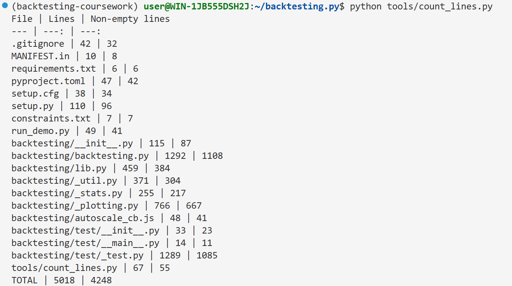
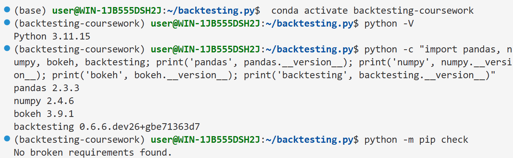
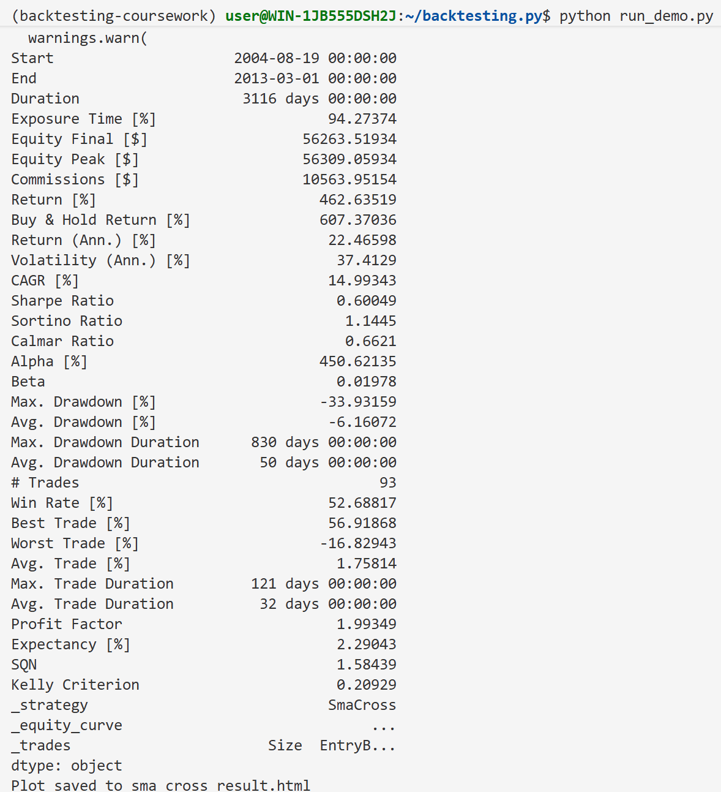
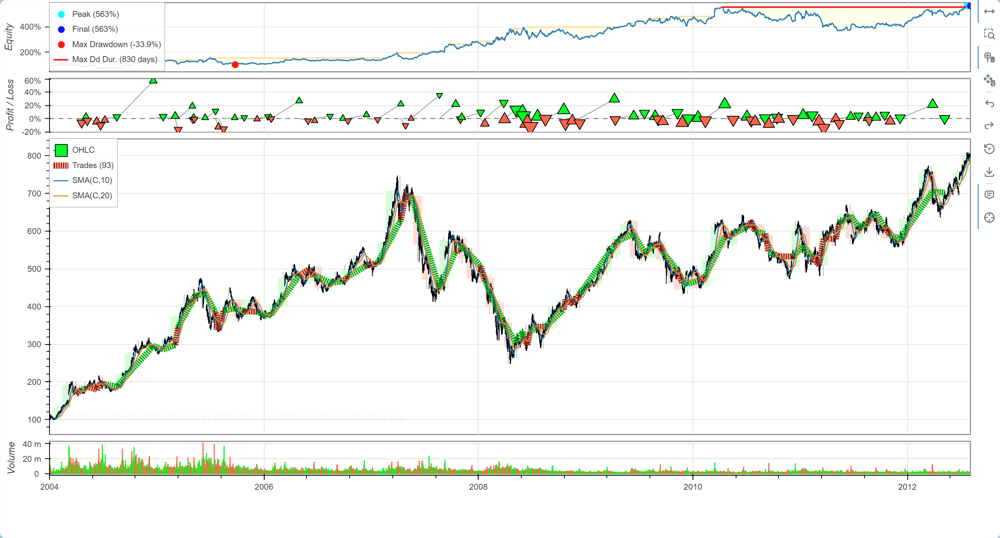

# Backtesting.py 金融回测框架源码复现、中文注释与工程设计剖析

## 1. 项目概述与选题理由

Backtesting.py 是一个面向 Python 的金融策略回测框架, 由开发者 kernc 在 GitHub 上开源维护。用户通过继承 `Strategy` 基类并实现 `init()` 和 `next()` 方法, 即可在历史行情数据上验证交易策略的表现。框架内部封装了事件驱动的回测引擎、订单撮合模型、交易/仓位状态管理、风险与收益统计计算以及基于 Bokeh 的交互式可视化, 构成了一个完整的回测工具链。

选择 Backtesting.py 作为《Python 高级程序设计》大作业的复现对象, 基于以下理由:

1. **真实工程规模适中**: 纳入注释统计的文件共 19 个, 总计 5018 行、4248 非空行, 超过课程要求"约 2000 行有效代码"的标准, 又不至于过于庞大而难以深入分析。
2. **体现 Python 高级设计思想**: 工程使用了 `ABCMeta` 元类定义抽象策略接口、`@property` 封装对象状态、`@contextmanager` 和 `__enter__/__exit__` 实现资源管理、生成器用于数据流、NumPy `ndarray` 子类化提升性能、多进程与共享内存支撑参数优化, 以及 `functools.partial`、`TYPE_CHECKING` 条件导入等工程化实践。
3. **结构完整, 适合逐层剖析**: 项目包含核心引擎、策略基类、工具库、统计模块、可视化模块、测试套件和工程配置文件七个层次, 注释和研究具有明确的模块边界。
4. **可独立运行和验证**: 工程提供示例数据 (`GOOG.csv` 等) 和完整的测试套件, 能够在本地独立搭建环境、安装依赖并成功复现结果。

## 2. 大作业要求对应情况

| 大作业要求 | 当前完成情况 | 证据 |
|:--|:--|:--|
| 选择真实开源 Python 工程, 中等规模, 约 2000 行有效代码 | Backtesting.py, 纳入注释统计的文件 19 个, 总计 5018 行、4248 非空行 | `line_count_report.txt` |
| 独立搭建环境、安装依赖, 确保样例代码成功运行, 并贴图展示运行结果 | 创建独立 conda 环境, 通过 `constraints.txt` 锁定 pandas<3, `run_demo.py` 成功运行并输出约 30 项统计指标, 生成 `sma_cross_result.html` | `01_env_install.png`, `02_run_demo_stats.png`, `03_html_plot.png` |
| 对每一行、每一个关键块提供中文注释, 注释覆盖功能层、设计层、上下文层 | 19 个文件全部添加注释, 覆盖功能层(做什么)、设计层(为什么这样写, 用了什么特性)、上下文层(在整个框架中的位置) | `ANNOTATION_GUIDE.md` 及全部源码文件 |
| 在复现基础上进行必要代码规范调整, 并撰写详尽剖析报告 | 新增 `constraints.txt` 锁定复现环境、`run_demo.py` 运行示例、`ANNOTATION_GUIDE.md` 注释规范、`COURSEWORK_SCOPE.md` 范围说明; 未修改核心回测逻辑; 本报告即为剖析报告 | 本文件及仓库 `coursework-annotated` 分支 |



## 3. 环境搭建与运行复现

### 3.1 环境准备

使用 conda 创建独立的 Python 环境, 避免与系统环境产生依赖冲突:

```bash
conda create -n backtesting-coursework python=3.11
conda activate backtesting-coursework
```

### 3.2 依赖安装

通过 `requirements.txt` 安装核心依赖 (numpy, pandas, bokeh) 及测试可选依赖 (matplotlib, scikit-learn, sambo, tqdm), 并通过 `constraints.txt` 约束 `pandas<3` 以避开上游兼容性问题:

```bash
python -m pip install -r requirements.txt -c constraints.txt
```

`requirements.txt` 中的 `.[test]` 语法表示从当前目录以可编辑模式安装 backtesting 包, 并附带 extras_require 中定义的 `test` 可选依赖组。实际运行时依赖在 `setup.py` 的 `install_requires` 中声明。

`constraints.txt` 中仅包含 `pandas<3`, 用于强制安装 pandas 2.x 版本。Backtesting.py 的 `FractionalBacktest` 类在 pandas 3.x 环境下会对只读 NumPy 数组执行原地除法操作 (`indicator /= self._fractional_unit`), 导致 `ValueError: output array is read-only`。约束 pandas 版本后该问题不再出现。



### 3.3 运行示例

工程提供了 `run_demo.py` 作为最小运行入口:

```python
from backtesting import Backtest, Strategy
from backtesting.lib import crossover
from backtesting.test import GOOG, SMA

class SmaCross(Strategy):
    n1 = 10
    n2 = 20

    def init(self):
        price = self.data.Close
        self.ma1 = self.I(SMA, price, self.n1)
        self.ma2 = self.I(SMA, price, self.n2)

    def next(self):
        if crossover(self.ma1, self.ma2):
            self.buy()
        elif crossover(self.ma2, self.ma1):
            self.sell()

if __name__ == "__main__":
    bt = Backtest(GOOG, SmaCross, commission=0.002, exclusive_orders=True)
    stats = bt.run()
    print(stats)
    bt.plot(filename="sma_cross_result.html", open_browser=False)
```

该策略使用两条简单移动平均线 (SMA(10) 和 SMA(20)) 的交叉产生交易信号: 快线上穿慢线则做多, 下穿则做空。数据源为 Google (GOOG) 2004 年至 2013 年的日线行情数据。执行 `python run_demo.py` 后, 终端输出约 30 项回测统计指标 (起始/结束时间、收益率、年化收益率、夏普比率、最大回撤、胜率、盈亏因子等), 并在当前目录生成 `sma_cross_result.html` 交互式图表。



## 4. 工程目录结构与注释范围

当前分支 `coursework-annotated` 下的工程目录可分为四类:

### 第一类: 核心源码 (逐行或关键块注释)

| 文件 | 作用 | 注释方式 |
|:--|:--|:--|
| `backtesting/backtesting.py` | 回测引擎核心 (Strategy/Order/Trade/_Broker/Backtest), 约 1292 行 | 逐行 + 块注释 |
| `backtesting/lib.py` | 策略辅助函数库 (crossover, resample_apply, SignalStrategy 等) | 逐行 + 块注释 |
| `backtesting/_util.py` | 内部工具: _Array (ndarray 子类), _Data, 共享内存管理器 | 逐行 + 块注释 |
| `backtesting/_stats.py` | 统计指标计算 (约 30 项金融指标) | 逐行 + 块注释 |
| `backtesting/_plotting.py` | Bokeh 可视化 (K 线、权益曲线、回撤、交易标记) | 关键块注释 |
| `backtesting/autoscale_cb.js` | Y 轴自动缩放 JavaScript 回调 | 关键块注释 |
| `backtesting/__init__.py` | 包入口, 暴露公开 API, 跨平台进程池 | 逐行注释 |
| `backtesting/test/__init__.py` | 示例数据加载 (GOOG, BTCUSD, EURUSD) 和 SMA 函数 | 逐行注释 |
| `backtesting/test/__main__.py` | 测试运行入口 | 逐行注释 |
| `backtesting/test/_test.py` | 76 个测试用例, 覆盖引擎/策略/优化/绘图/回归 | 类级 + 方法级注释 |

### 第二类: 已注释的工程配置文件

| 文件 | 作用 |
|:--|:--|
| `setup.py` | 安装/打包/依赖声明, 含 install_requires 和 extras_require |
| `setup.cfg` | flake8 代码风格、mypy 类型检查、coverage 覆盖率配置 |
| `pyproject.toml` | ruff linter 规则配置 |
| `MANIFEST.in` | sdist 源码分发包文件清单 |
| `requirements.txt` | pip 安装入口 (`.[test]`) |
| `.gitignore` | Git 忽略规则 (编译产物、IDE 配置、虚拟环境等) |
| `constraints.txt` | 环境版本约束 (`pandas<3`) |

### 第三类: 辅助交付件

| 文件 | 作用 |
|:--|:--|
| `run_demo.py` | SMA 交叉策略最小运行示例 |
| `tools/count_lines.py` | 代码行数统计脚本 |
| `line_count_report.txt` | 行数统计报告 (19 文件, 5018 行, 4248 非空行) |
| `ANNOTATION_GUIDE.md` | 中文注释规范 (三层注释+约束规则) |
| `COURSEWORK_SCOPE.md` | 课程大作业范围说明 |

### 第四类: 保留原貌, 不原地注释

- `README.md` -- 原作者项目说明文档, 包含使用手册、教程链接和 FAQ。修改会破坏原始语义。
- `LICENSE.md` -- AGPL-3.0 开源协议文本。开源协议内容不应被修改。
- `backtesting/test/GOOG.csv`, `BTCUSD.csv`, `EURUSD.csv` -- 示例行情数据文件, 由 pandas 通过 `read_csv` 读取。在其中插入中文注释会破坏 CSV 格式, 导致数据加载失败。

## 5. 核心回测流程分析

Backtesting.py 的回测流程体现了典型的事件驱动架构。整个流程由 `Backtest.run()` 统一编排, 可以划分为初始化、主循环、统计结算三个阶段。

### 5.1 初始化阶段

用户首先创建 `Backtest` 实例, 传入行情数据 DataFrame、策略类 (非实例)、初始资金、佣金率、保证金比例、交易模式等参数。`Backtest.__init__` 对输入数据进行严格校验: 检查 OHLCV 列完整性、NaN 值、时间索引有序性, 并将非 DatetimeIndex 的数值索引智能转换为时间索引。

然后用户调用 `bt.run(**params)`, 这里的 `params` 会被传递给策略构造函数。`run()` 内部依次执行:

1. 创建 `_Data` 实例包裹 DataFrame, 将每列转换为 `_Array` (NumPy ndarray 子类), 缓存完整数组并支持动态长度控制。
2. 通过 `functools.partial` 延迟创建的 `_Broker` 实例化, 注入 cash、spread、commission、margin 等交易参数。
3. 以 broker 和 data 为参数实例化策略对象, 调用 `strategy.init()`。

在 `strategy.init()` 中, 用户通过 `self.I(func, data, *args)` 预计算技术指标。`I()` 方法的核心工作包括: 自动生成指标名称、执行指标函数、将结果包装为 `_Indicator` (标记子类)、根据指标值与 Close 的接近程度判断 overlay 属性 (叠加在 K 线图上还是显示在独立子图)、将指标添加到 `self._indicators` 列表。`init()` 阶段可以访问完整的历史数据, 所有指标一次性向量化计算完毕。

### 5.2 主循环阶段

主循环从 `start` (指标预热期结束位置) 开始, 逐根 K 线推进, 共 `len(data) - start` 个周期。每个周期执行三个操作:

**Step 1: 数据揭示**。调用 `data._set_length(i + 1)` 将数据访问器的可见长度设置为当前 K 线位置。后续所有对 `self.data.Close` 等属性的访问只能读取到 `[:i+1]` 范围的数据, 模拟实时行情逐步揭示的过程, 避免未来信息泄露。同时将每个指标的切片更新到策略实例的对应属性上。

**Step 2: 订单撮合**。调用 `broker.next()`, 内部执行 `_process_orders()`。这是整个引擎中最复杂的逻辑。订单队列按以下优先级处理:

- **止损检查**: 对于设置了 `stop` 价格的订单, 检查当前 K 线的高低点是否触及止损价。触及后 `stop` 被清除, 订单转为市价或限价单。
- **限价检查**: 对于设置了 `limit` 的订单, 检查价格是否到达限价范围内。悲观假设 (限价在止损之前触及) 导致某些订单被推迟到下一周期。
- **成交价确定**: 限价单取限价与 stop/open 之间的最优值; 市价单取开盘价 (或 `trade_on_close=True` 时的前收盘价)。
- **contingent 订单处理**: SL/TP 订单关联到父交易。当价格触及 SL/TP 时, 通过 `_reduce_trade` 或 `_close_trade` 平掉对应仓位。
- **对冲/非对冲模式**: 非对冲模式下, 新订单会 FIFO 平掉反向的现有仓位 (`_reduce_trade` / `_close_trade`)。对冲模式下允许同时持有双向仓位。
- **保证金检查**: 计算可用保证金是否足够开仓。不足时取消订单并发出警告。
- **开仓**: 调用 `_open_trade` 创建 `Trade` 实例, 扣除佣金, 设置 SL/TP 订单。

撮合完成后记录当前权益值到 `_equity` 数组。如果权益 <= 0, 则触发 `_OutOfMoneyError`, 清空所有仓位并终止回测。

**Step 3: 策略决策**。调用 `strategy.next()`。用户在此根据当前指标值 (如 `self.ma1[-1]` 取最新值, `self.ma1[-2]` 取前一根值) 调用 `buy()` 或 `sell()` 创建订单。这些订单在**下一个** K 线周期的 Step 2 中才会被处理。

### 5.3 统计结算阶段

主循环结束后, 如果设置了 `finalize_trades=True`, 则平掉所有未平仓交易; 否则发出警告。随后 `compute_stats()` 基于权益数组和已平仓交易列表计算约 30 项统计指标, 包括: 收益率、年化收益率、波动率、夏普比率、索提诺比率、卡尔玛比率、最大回撤及持续期、胜率、盈亏因子、SQN、凯利准则等。结果以 `_Stats` (pd.Series 子类) 形式返回。

### 5.4 参数优化流程

`Backtest.optimize()` 支持两种优化方法: 网格搜索 (`method='grid'`) 和 SAMBO 贝叶斯优化 (`method='sambo'`)。网格搜索枚举参数的笛卡尔积, 通过多进程池 (`backtesting.Pool`) 并行运行各参数组合的回测。数据通过 `SharedMemoryManager` 写入共享内存传递给子进程, 避免 pickle 大数据集, 提升效率。结果以 MultiIndex Series 形式返回, 可通过 `plot_heatmaps()` 可视化为热力图。

## 6. Python 高级特性分析

Backtesting.py 在多处运用了 Python 高级特性, 这些特性不是孤立存在的语法糖, 而是服务于工程设计的核心机制。

### 6.1 ABCMeta 元类与 @abstractmethod

`Strategy` 类的定义使用了 `metaclass=ABCMeta`:

```python
class Strategy(metaclass=ABCMeta):
    @abstractmethod
    def init(self): ...

    @abstractmethod
    def next(self): ...
```

`ABCMeta` 是 Python 标准库 `abc` 模块提供的元类。当一个类以 `ABCMeta` 为元类时, 如果子类没有实现所有被 `@abstractmethod` 标记的方法, 在实例化时 Python 解释器会抛出 `TypeError`, 阻止创建不完整的对象。这比在基类方法中 `raise NotImplementedError` 更加严格, 因为错误在实例化阶段而非方法调用阶段就被捕获。

`Strategy` 通过 ABstraact Meta 强制用户实现 `init()` 和 `next()` 两个方法, 定义了策略与框架之间的接口契约。任何继承 `Strategy` 的子类都必须遵守这一契约, 否则无法运行。这种设计是模板方法模式的基础 -- 框架定义了算法骨架 (`Backtest.run()` 中的主循环流程), 但将具体步骤 (`init()` 和 `next()`) 延迟到子类实现。

### 6.2 模板方法模式

`Backtest.run()` 是模板方法模式的枢纽。它控制着回测的整体流程 -- 数据准备、指标预热、主循环推进、统计结算 -- 但将交易决策的逻辑完全交给用户定义的 `Strategy.init()` 和 `Strategy.next()`。框架不关心用户使用什么指标、做出什么交易决策, 只负责按约定顺序调用这些方法, 并在每次调用前准备好正确的上下文 (逐步揭示的数据、更新后的指标值)。

这种设计使得框架核心与策略逻辑松耦合。用户可以完全专注于策略本身, 而无需修改回测引擎的代码。这是面向对象设计中"开闭原则"的体现: 对扩展开放 (继承 Strategy 写新策略), 对修改关闭 (不需要改动 Backtest 和 _Broker)。

### 6.3 @property 属性封装

框架大量使用 `@property` 装饰器将方法伪装为属性访问, 提供简洁直观的 API:

- `Strategy.position` / `Strategy.trades` / `Strategy.equity` -- 将内部 broker 状态以只读属性的形式暴露给用户, 隐藏了 `self._broker` 的实现细节。
- `Trade.sl` / `Trade.tp` 同时定义了 getter 和 setter: getter 返回关联订单的止损/止盈价格, setter 负责取消旧订单、创建新订单。这种封装使得修改止损价的操作只需 `trade.sl = 100`, 而无需了解底层订单管理逻辑。
- `_Data.Close` / `_Data.Open` 等 OHLCV 属性通过 `@property` 返回缓存的 `_Array` 切片视图, 将 DataFrame 的列访问转换为 ndarray 访问, 在提升性能的同时保持了 `data.Close` 的自然语法。

### 6.4 NumPy ndarray 子类化

`_Array` 继承自 `np.ndarray`, 是框架中最核心的内部数据结构。ndarray 子类化的难点在于: NumPy 创建新数组的操作 (切片、reshape、ufunc 等) 默认返回普通 ndarray, 会丢失子类的自定义属性。

`_Array` 通过以下机制解决这一难题:

- `__new__` 而非 `__init__`: 因为 ndarray 是不可变对象, 构造逻辑必须在 `__new__` (对象分配阶段) 完成。`.view(cls)` 将已有数组的类型转换为 `_Array`, 避免数据拷贝。
- `__array_finalize__`: 当 NumPy 从已有数组创建新数组时自动调用这个方法, 负责将源对象的 `.name` 和 `._opts` 属性传播到新对象。这确保了指标经过任何 NumPy 运算后仍保留元数据。
- `__reduce__` / `__setstate__`: 重写 pickle 序列化协议, 在多进程优化中通过共享内存传递指标数据时保持自定义属性的完整性。

`_Indicator` 是 `_Array` 的空子类, 仅用于 `isinstance` 类型区分。这允许 `_strategy_indicators()` 函数从策略实例的 `__dict__` 中筛选出指标属性而非普通 Python 变量。

### 6.5 __getattr__ 动态属性代理

`_Data` 类通过 `__getattr__` 实现了动态的属性访问机制:

```python
def __getattr__(self, item):
    try:
        return self.__get_array(item)
    except KeyError:
        raise AttributeError(...)
```

当用户访问 `self.data.Close` 时, Python 首先在实例的 `__dict__` 中查找 `Close` 属性。由于 `_Data` 没有显式定义名为 `Close` 的实例变量, 属性查找回退到 `__getattr__`。`__getattr__` 将属性名转发给 `__get_array('Close')`, 从内部缓存的 `_Array` 字典中取出对应列的切片视图。

这种代理模式的优势在于: `_Data` 不需要预先枚举所有可能的列名, 用户可以传入任意列名的 DataFrame (如额外的 `P/E`、`MCap` 等), 框架自动代理这些列的访问。同时, `__getitem__` 也提供了 `data['Close']` 的字典式访问语法。

### 6.6 上下文管理器

工程中使用了两种上下文管理器:

**@contextmanager 装饰的 patch()**: 将生成器函数转换为上下文管理器。`patch(obj, attr, newvalue)` 在进入 `with` 块时设置 `obj.attr = newvalue`, 退出时恢复原值或删除临时添加的属性。典型应用场景是 `FractionalBacktest.run()` 中临时用缩放后的数据替换原始 `self._data`, 以及在 SharedMemory 构造函数中临时禁用资源追踪注册。

**SharedMemoryManager**: 实现了标准的 `__enter__` / `__exit__` 协议。进入时返回自身, 退出时遍历所有创建的共享内存块并依次 `close()` 和 `unlink()`。这确保了即便在异常发生时, 共享内存也能被正确释放, 避免系统资源泄漏。

### 6.7 生成器

`random_ohlc_data()` 使用 `yield` 实现了无限生成器, 每次迭代返回一组具有与原始数据相似统计特征的随机 OHLC 数据。生成器内部通过 `while True` 循环 + 有放回抽样 + 价格偏移量累积实现, 每次 `next()` 返回新的 DataFrame。这种设计使得蒙特卡洛模拟和策略压力测试可以按需生成数据, 而无需一次性生成大量数据占用内存。

### 6.8 多进程与共享内存

`Backtest.optimize()` 在网格搜索模式下使用多进程池并行运行各参数组合的回测。`SharedMemoryManager` 将 DataFrame 序列化到共享内存区域, 子进程从共享内存读取数据而无需通过 pickle 传递大 DataFrame。`SharedMemoryManager.arr2shm()` 将一维数组写入共享内存, `shm2df()` 从共享内存恢复为完整 DataFrame。对于含时区信息的 datetime 列, 会先做 `tz_localize(None)` 转换, 因为 NumPy 不直接支持 tz-aware 类型。

此外, Python 3.13 修改了 SharedMemory 的 API (`track` 参数), 工程通过 `sys.version_info` 版本分支处理了 Python 3.9-3.12 与 3.13+ 的兼容性差异。

### 6.9 函数式工具

`lib.py` 中的 `crossover()`、`cross()`、`barssince()` 等函数提供了简洁的函数式信号表达。`crossover()` 支持 ndarray、pd.Series 和常数三种输入类型, 内部统一转换为数组后通过相邻元素比较判断上穿。`resample_apply()` 使用 `inspect.currentframe()` 进行调用栈自省, 向上遍历最多 3 帧来检测是否在 `Strategy.init()` 内部被调用, 从而决定是否自动通过 `self.I()` 注册指标。这是 Python 运行时自省 (introspection) 能力的典型应用。

## 7. 关键模块源码剖析

### 7.1 backtesting/backtesting.py -- 核心回测引擎

这是整个工程中最核心的模块。文件包含约 1292 行代码, 定义了 7 个核心类和一个异常类:

**Strategy (策略基类)**: 使用 `ABCMeta` 元类和两个 `@abstractmethod` (`init`, `next`) 定义策略接口。`I()` 方法提供指标注册机制, 负责名称格式化、数组形状验证、overlay 启发式判定、`_Indicator` 包装和自动注册。`buy()` 和 `sell()` 方法将订单创建委托给 `_Broker.new_order()`。通过 `@property` 暴露 `position`、`trades`、`equity`、`data` 等状态访问器。

**Order (订单)**: 封装了一笔交易指令的全部信息 (size、limit、stop、sl、tp、tag)。支持市价单、限价单、止损单和止损限价单四种类型。`is_contingent` 属性判断是否为关联到已有交易的 SL/TP 条件单。属性使用双下划线前缀 (`__size` 等), 通过 Python 的 name mangling 机制防止子类属性冲突。

**Trade (交易)**: 订单成交后产生的交易记录。跟踪进场价格、出场价格、进出场 K 线编号、关联的 SL/TP 订单、累计佣金和用户标签。`pl` 和 `pl_pct` 属性实时计算浮动盈亏。`sl` 和 `tp` 属性使用 `@setter` 实现可读写接口, 底层通过 `__set_contingent()` 管理关联条件订单的生命周期。

**_Broker (内部撮合引擎)**: 这是回测引擎的心脏。维护订单队列 (`orders`)、活跃交易列表 (`trades`)、已平仓交易历史 (`closed_trades`) 和权益曲线数组 (`_equity`)。`_process_orders()` 方法实现了完整的订单撮合逻辑, 核心难点在于: 止损触发后的订单类型转换、限价与止损在同一 K 线内的悲观假设、contingent 订单的关联平仓、非对冲模式下的 FIFO 反向仓位关闭、比例仓位 (`-1 < size < 1`) 到实际股数的转换、保证金不足时的订单取消。`_reduce_trade()` 支持部分平仓, 通过 `_copy()` 创建原交易的缩减副本。`_close_trade()` 处理完全平仓, 并在进场和出场各扣一次佣金。

**Backtest (回测引擎入口)**: `__init__` 对输入数据进行严格校验, 并将 `_Broker` 的构造函数包装为 `functools.partial` 以支持多次 `run()` 调用。`run()` 编排完整的回测流程 (见第 5 节)。`optimize()` 支持网格搜索和 SAMBO 贝叶斯优化, 使用 `_mp_task` 静态方法在多进程中并行执行回测。`plot()` 将可视化委托给 `_plotting.plot()`。

### 7.2 backtesting/lib.py -- 策略辅助函数库

`lib.py` 提供了用户策略开发中最常用的工具函数和可组合策略基类。

`crossover()` 和 `cross()` 是最基础的信号函数, 前者判断上穿, 后者判断任意方向交叉。`resample_apply()` 解决了多时间框架指标计算的难题: 先将数据重采样到目标频率, 对聚合后的数据应用指标函数, 再将结果映射回原始时间索引 (使用 `ffill` 前向填充避免 look-ahead bias)。它的独特之处在于通过 `inspect.currentframe()` 检测调用栈, 自动判断是否在 `Strategy.init()` 内被调用, 从而决定是否通过 `self.I()` 注册指标。

`SignalStrategy` 将回测从"逐 K 线判断"简化为"预设信号向量", 用户只需在 `init()` 中设置进场/出场信号数组, `next()` 自动处理订单。`TrailingStrategy` 提供基于 ATR 的自动跟踪止损, 止损价单向移动 (多头只升不降, 空头只降不升)。`FractionalBacktest` 通过价格/成交量的缩放变换实现分数股交易支持。`MultiBacktest` 支持同一策略在多个品种上并行运行, 并汇总结果。

`random_ohlc_data()` 是一个无限生成器, 通过随机抽样和价格偏移量累积生成具有与示例数据相似统计特征的 OHLC 行情, 可用于策略的蒙特卡洛模拟和压力测试。

### 7.3 backtesting/_util.py -- 内部工具与数据结构

`_util.py` 是工程的基础设施层, 提供了被其他模块广泛使用的工具函数和核心数据结构。

`_Array(np.ndarray)` 是框架中最关键的数据结构。它继承 NumPy 的 ndarray, 但额外携带 `.name` 和 `._opts` 两个属性, 使得指标数组兼具 ndarray 的计算性能和 pandas 式的元数据追踪能力。`__array_finalize__` 确保 NumPy 运算 (切片/reshape/ufunc) 后自定义属性不丢失, 这是 NumPy 子类化协议的核心。`__reduce__` 和 `__setstate__` 支持 pickle 序列化, 满足多进程优化的需求。`__bool__` 和 `__float__` 使得 `if self.ma1:` 和 `float(self.ma1)` 能直接取最新值。

`_Data` 是 OHLCV 数据的访问器, 通过 `__getattr__` 实现动态列访问代理。它维护两种缓存: 完整长度的数组缓存 (`__arrays`) 和当前可见长度的切片缓存 (`__cache`)。回测主循环每推进一根 K 线, 就通过 `_set_length(i+1)` 更新可见长度并清缓存, 确保下次访问拿到正确长度的切片。返回的切片是视图而非拷贝, 内存效率高。

`SharedMemoryManager` 是上下文管理器, 用于多进程优化时共享数据。它将 DataFrame 的每一列通过 `arr2shm()` 写入 System V 共享内存区域, 子进程通过 `shm2df()` 从共享内存恢复数据。相比 pickle 序列化, 共享内存避免了大数据集的重复拷贝。

### 7.4 backtesting/_stats.py -- 统计指标计算

`compute_stats()` 接收交易列表、权益数组、OHLC 数据和策略实例, 输出包含约 30 项指标的 `pd.Series`。指标覆盖四个维度:

- **基础信息**: Start, End, Duration, Exposure Time。
- **收益指标**: Return, Buy & Hold Return, Return (Ann.), CAGR。年化收益率采用几何平均日收益的复利公式, 年化波动率使用复合收益方差公式。
- **风险指标**: Sharpe Ratio (年化超额收益/年化波动率), Sortino Ratio (仅用下行波动率), Calmar Ratio (年化收益/最大回撤), Max Drawdown, Avg Drawdown, Max Drawdown Duration。回撤持续期和幅度通过 `compute_drawdown_duration_peaks()` 计算, 该函数定位回撤为 0 的基准点, 将序列切分为回撤区间。
- **交易表现**: # Trades, Win Rate, Best/Worst Trade, Avg Trade, Profit Factor, Expectancy, SQN (System Quality Number), Kelly Criterion。SQN 由 Van Tharp 提出, 综合考虑交易次数、平均盈亏和盈亏标准差。Kelly Criterion 基于胜率和盈亏比计算最优仓位比例。

`_Stats(pd.Series)` 子类仅重写了 `__repr__` 方法, 通过 `pd.option_context` 临时调整显示精度和列宽, 使打印输出更紧凑友好。

### 7.5 backtesting/_plotting.py 与 autoscale_cb.js -- 可视化模块

`_plotting.py` 使用 Bokeh 库生成交互式 HTML 图表。`plot()` 函数是图表的组装中心, 内部定义了 7 个内部子函数, 分别负责:

- `_plot_ohlc()`: 主 OHLC K 线图, 用竖线表示 High-Low 区间, 彩色柱表示涨跌。
- `_plot_equity_section()`: 权益曲线, 标注峰值、终值和最大回撤区间。
- `_plot_drawdown_section()`: 回撤百分比独立子图。
- `_plot_pl_section()`: 每笔交易的盈亏标记, 用三角形表示盈亏方向。
- `_plot_volume_section()`: 成交量柱状图, 显示 X 轴时间标签。
- `_plot_superimposed_ohlc()`: 叠加更大周期的半透明 K 线, 辅助判断大趋势。
- `_plot_indicators()`: 策略指标, overlay 型画在 K 线图上, 独立型画在单独子图。

所有子图通过 `gridplot` 垂直堆叠, 共享 X 轴范围。`LegendStr(str)` 子类通过自定义 `__eq__` (按对象标识比较而非字符串内容) 解决了 Bokeh 默认合并同名字符串图例项的问题。`CrosshairTool` 为所有子图添加统一的十字光标。

`autoscale_cb.js` 是嵌入 HTML 的 JavaScript 回调。当用户平移或缩放 X 轴时, 浏览器端自动计算可视区域内的最高/最低价格, 调整 OHLC 图表的 Y 轴范围, 使 K 线始终充满图表区域。使用 `setTimeout(50ms)` 防抖避免频繁重绘。

### 7.6 测试文件

`backtesting/test/_test.py` 包含 76 个测试用例, 按功能分为 8 个 TestCase 子类:

- `TestBacktest`: 验证回测引擎基本功能 -- 运行、数据验证、佣金计算、订单断言。
- `TestStrategy`: 验证策略机制 -- 仓位、对冲模式、exclusive_orders、订单 tag。
- `TestOptimize`: 验证参数优化 -- 网格搜索、SAMBO、约束、热力图。
- `TestPlot`: 验证图表生成 -- 各种参数组合、时间分辨率、指标命名和颜色。
- `TestLib`: 验证工具库 -- crossover、resample_apply、SignalStrategy、TrailingStrategy。
- `TestUtil`: 验证内部工具 -- _as_str、patch、_Array 访问器。
- `TestDocs`: 验证文档 -- docstring 和 README 中的统计字段完整性。
- `TestRegressions`: 回归测试 -- 针对已修复的 GitHub issue 的防护用例。

在约束环境 (`pandas<3`) 下, 全部 76 项测试通过, 1 项跳过 (`test_examples`, 因 `doc/` 目录已删除)。

## 8. 运行结果、可视化与测试验证

### 8.1 回测统计输出

`python run_demo.py` 在终端输出以下统计结果 (约 30 项):

- Start/End/Duration: 回测起止时间和总历时 (3116 天)
- Exposure Time [%]: 持仓暴露时间占比
- Equity Final/Peak [$]: 最终权益和峰值权益
- Return [%] / Buy & Hold Return [%]: 策略收益和买入持有基准收益
- Return (Ann.) [%] / Volatility (Ann.) [%]: 年化收益率和年化波动率
- Sharpe Ratio / Sortino Ratio / Calmar Ratio: 三项风险调整收益指标
- Max. Drawdown [%] / Avg. Drawdown [%]: 最大回撤和平均回撤
- # Trades / Win Rate [%]: 交易次数和胜率
- Profit Factor / Expectancy [%] / SQN / Kelly Criterion: 交易质量指标

### 8.2 HTML 可视化

`sma_cross_result.html` 是一个完全交互式的 Bokeh 图表, 从上到下依次展示:

- 权益曲线 (含峰值/终值标记和最大回撤区间)
- P/L 盈亏标记 (每笔交易的三角形标记)
- 主 OHLC K 线图 (叠加 SMA(10)/SMA(20) 均线)
- 成交量柱状图

用户可以在浏览器中对图表进行平移、缩放、悬停查看详情, 支持保存为 PNG 等交互操作。



### 8.3 测试验证

在约束环境 (`pandas<3`) 下运行 `python -m backtesting.test`, 结果如下:

- 76 tests OK
- 1 skipped: `test_examples` (需要已删除的 `doc/` 目录)

跳过的原因已在 `COURSEWORK_SCOPE.md` 中说明: `doc/` 目录包含文档站和示例 notebook, 不属于本次课程注释范围, 因此从分支中删除。该跳过项不影响核心回测功能的验证。

## 9. 代码规范调整说明

本次复现过程中的代码规范调整以注释规范、运行入口、环境约束和范围说明为主, 未改变核心回测逻辑:

1. **注释规范**: 新增 `ANNOTATION_GUIDE.md`, 统一注释的三层覆盖要求 (功能层/设计层/上下文层) 和约束规则 (不修改函数名/类名/导入路径, 不改变核心逻辑, 不改 README/LICENSE/CSV, 不将中文注释放入字符串/CSV 体内, 每批注释后运行验证)。
2. **运行入口**: 新增 `run_demo.py`, 使用 GOOG 日线数据和 SMA 交叉策略, 作为最小可运行示例。
3. **环境约束**: 新增 `constraints.txt`, 锁定 `pandas<3` 以避免 pandas 3.x 下 FractionalBacktest 的上游兼容性问题。
4. **范围说明**: 新增 `COURSEWORK_SCOPE.md`, 明确文件分类 (核心源码/工程配置/辅助交付件/保留原貌) 和注释范围。
5. **规模统计**: 新增 `tools/count_lines.py` 和 `line_count_report.txt`, 统计纳入注释的 19 个文件的行数 (5018 行 / 4248 非空行)。
6. **未修改内容**: 未改变任何函数名、类名、变量语义或导入路径。未修改核心回测逻辑。未修改 README、LICENSE 和 CSV 数据文件。

## 10. 问题与解决方案

### 10.1 pandas 3.x 兼容性问题

**问题**: 在 pandas 3.0 及以上版本环境中, `FractionalBacktest.run()` 方法对只读 NumPy 数组执行原地除法 (`indicator /= self._fractional_unit`), 抛出 `ValueError: output array is read-only`。该问题源于 pandas 3.x 对 DataFrame 列的底层数组实施了更严格的写保护。

**解决**: 新增 `constraints.txt`, 约 `pandas<3`。在 `REPORT_DRAFT.md` 和 `COURSEWORK_SCOPE.md` 中记录该问题及解决方法。约束后环境安装 pandas 2.3.3, `python -m backtesting.test` 全部 76 项测试通过。

### 10.2 README、LICENSE、CSV 是否要注释

**问题**: 课程大作业要求"对每一行、每一个关键块提供中文注释"。但 README.md 是原项目说明文档, 注释会破坏原始语义; LICENSE.md 是法律文本, 不应被修改; CSV 数据文件中插入中文会导致 pandas `read_csv` 解析失败, 破坏 `run_demo.py` 和测试套件的运行。

**解决**: 在 `ANNOTATION_GUIDE.md` 的约束规则中明确这三类文件不原地注释, 在 `COURSEWORK_SCOPE.md` 和本报告中解释保留原貌的原因。这些文件的作用通过辅助文档说明, 而非在文件内部插入注释。

### 10.3 精简仓库与完整工程的平衡

**问题**: Backtesting.py 的原始仓库包含 GitHub Actions CI 配置 (`.github/`)、文档站 (`doc/`)、贡献指南 (`CONTRIBUTING.md`)、变更日志 (`CHANGELOG.md`)、覆盖率配置 (`.codecov.yml`) 等维护内容。全量注释这些文件工作量过大且偏离课程核心 -- 回测框架的 Python 源码设计和工程结构。

**解决**: 保留核心源码、测试代码、示例数据、工程配置文件和最小运行示例, 删除 CI 配置、文档站、变更日志、贡献指南和覆盖率服务配置。保留的 19 个文件覆盖了 Python 工程的核心层次, 删除的非核心维护内容在 `COURSEWORK_SCOPE.md` 中说明。

## 11. 总结

通过本次对 Backtesting.py 的复现、注释和剖析, 完成了以下工作:

1. **工程复现**: 从 GitHub 克隆原始仓库, 独立搭建 conda 环境, 安装依赖, 并通过 `constraints.txt` 解决 pandas 版本兼容问题, 确保 `run_demo.py` 成功运行并生成可视化结果。
2. **源码注释**: 对 19 个文件 (核心源码 10 个 + 工程配置 7 个 + 辅助脚本 2 个) 进行了中文注释, 覆盖功能层 (做什么)、设计层 (为什么这样写, 用了什么特性) 和上下文层 (在框架中的位置) 三个层次。注释过程中遵循了不修改函数名/类名/导入路径、不改变核心逻辑、不改 README/LICENSE/CSV 的约束。
3. **框架理解**: 通过逐行阅读和注释, 理清了事件驱动回测的完整流程 -- 从数据准备、策略初始化、指标注册, 到主循环中的订单撮合 (stop/limit/market 优先级处理)、交易状态维护、权益跟踪, 再到统计结算和可视化输出。`_Broker._process_orders()` 的撮合逻辑是理解回测精度的关键, 其中对止损/限价在同一 K 线内的悲观假设体现了对前视偏差 (look-ahead bias) 的严谨处理。
4. **高级特性理解**: 工程中的 `ABCMeta` 元类不是孤立的语法展示, 而是服务于"强制接口契约"这一设计意图。`_Array` 的 ndarray 子类化解决了性能 (ndarray 运算速度) 与元数据 (名称、绘图配置) 的矛盾。`@contextmanager` 和 `__enter__/__exit__` 分别以函数式和类式两种方式实现资源管理。`inspect.currentframe()` 的调用栈自省使得 `resample_apply()` 能感知调用上下文并自动调整行为。
5. **测试验证**: 在约束环境下运行完整测试套件, 76 项测试全部通过, 验证了注释过程未引入回归, 也确认了约束方案的有效性。

后续可以进一步扩展的方向包括: 基于 `Backtest.optimize()` 对 SmaCross 策略进行参数优化并分析热力图、引入更多自定义策略验证框架的泛化能力、对比网格搜索与 SAMBO 贝叶斯优化的效率差异等。
